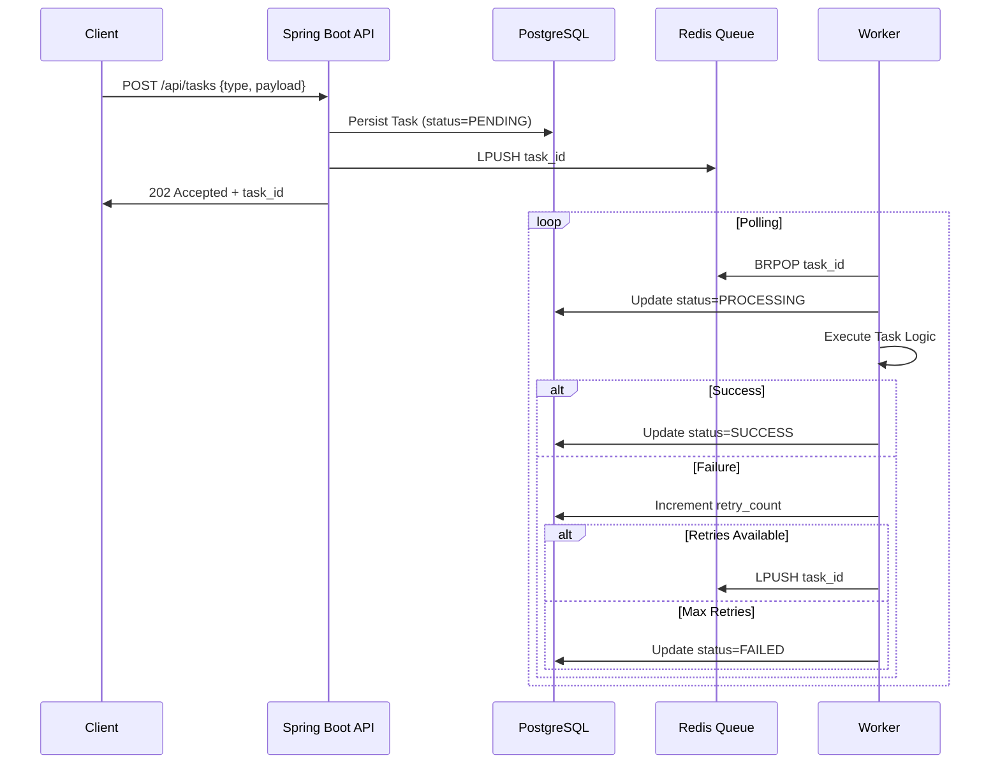

# Distributed-Task-Scheduler

Of course. Here is a detailed case study for your Distributed Task Scheduler project. This format is perfect for your resume, LinkedIn, and portfolio site as it tells a compelling story about your technical and problem-solving skills.

---

### **Case Study: Distributed Task Scheduler**

#### **Executive Summary**
Designed and implemented a high-performance, distributed background job processing system to solve the problem of handling long-running and asynchronous operations in a scalable and resilient manner. The system decouples task submission from execution, allowing main application threads to respond quickly while ensuring tasks are processed reliably across multiple worker nodes. This architecture is a foundational component of modern microservices, similar to systems like AWS Step Functions or Google Cloud Tasks.

#### **The Problem**
In monolithic applications, time-consuming processes like sending emails, generating reports, or processing files are often executed within the same request/response cycle. This leads to:
*   **Poor User Experience:** Users face slow response times as they wait for these processes to finish.
*   **System Vulnerability:** A failure in one of these processes (e.g., an external API being slow) can cause the entire application request to fail.
*   **Lack of Scalability:** It's difficult to scale these specific workloads independently from the main web application.

#### **The Solution**
A distributed task scheduling system built on a producer-consumer model using Spring Boot. The solution consists of three core components:
1.  **REST API (Producer):** Accepts task submissions, persists them to a database, and places them on a message queue.
2.  **Redis Message Queue:** Acts as a durable buffer, decoupling the API from the workers and allowing for asynchronous communication.
3.  **Worker Processes (Consumers):** Independently scalable services that poll the queue, process tasks, and update their status, implementing retry logic for failures.

#### **Technical Architecture & Implementation**

**Tech Stack:** Java 17, Spring Boot 3.3, Spring Data JPA, Redis (Lettuce client), PostgreSQL, Docker, Docker Compose, Maven.

**System Workflow:**

**Key Features Implemented:**
*   **RESTful API:** Provided clean endpoints for submitting and monitoring tasks, returning immediate acceptance (HTTP 202) for asynchronous processing.
*   **Database Persistence:** Used PostgreSQL with Spring Data JPA to reliably store all task metadata, ensuring no task is lost and its state is always traceable.
*   **Redis for Decoupling:** Implemented Redis lists as a simple, yet powerful, message queue to reliably pass tasks from the API to the workers.
*   **Robust Worker Logic:** Engineered idempotent workers that handle task processing, manage state transitions (PENDING → PROCESSING → SUCCESS/FAILED), and implement exponential backoff for retries on transient failures.
*   **Containerization:** Defined multi-container Docker environments using Docker Compose for seamless local development and testing, mimicking a production-like setup.

#### **Challenges & Solutions**
*   **Challenge: Ensuring At-Least-Once Delivery**
    *   **Problem:** A network glitch could cause a worker to crash after processing a task but before marking it as complete, leading to the task being redelivered and executed twice.
    *   **Solution:** Designed all task logic to be **idempotent** (able to be applied multiple times without changing the result beyond the initial application). This meant using unique IDs in operations and checking if an action had already been performed before doing it again.

*   **Challenge: Coordinating Concurrent Workers**
    *   **Problem:** Multiple workers pulling from the same queue could create race conditions or process the same task.
    *   **Solution:** Leveraged Redis's `BRPOP` command, which atomically removes a task from the list. This operation is atomic and thread-safe, guaranteeing that only one worker receives a given task.

*   **Challenge: Monitoring and Debugging**
    *   **Problem:** Understanding what's happening inside a distributed system is complex.
    *   **Solution:** Integrated Spring Boot Actuator for health checks and metrics. Implemented comprehensive logging throughout the task lifecycle and provided a simple API endpoint (`GET /api/tasks/{id}`) to check the status of any task.

#### **Results & Impact**
*   **Theoretical Performance:** The decoupled architecture allows the web API to remain responsive regardless of backend task load. Horizontal scaling is achieved simply by launching more worker containers, improving system throughput significantly.
*   **Improved Reliability:** The retry mechanism and persistent state management ensured task execution was resilient to temporary failures (e.g., network timeouts, third-party API downtime).
*   **Foundation for Scale:** This project demonstrated a critical software architecture pattern (asynchronous processing) that is essential for building scalable, cloud-native applications. It served as a practical implementation of key distributed systems concepts.

#### **Lessons Learned**
This project provided deep, hands-on experience with the challenges of distributed systems, including concurrency, state management, and message-based communication. It solidified understanding of how to use databases and queues together to build reliable systems and highlighted the importance of idempotency and careful logging in a microservices environment.

---

### **How to Use This Case Study:**

1.  **On Your Resume:** Include a "Projects" section and use 2-3 bullet points **summarizing** this case study. Focus on the *what* and the *impact*.
    *   *"Engineered a distributed task scheduler using Java/Spring Boot to decouple and reliably process background jobs, implementing Redis for messaging and idempotent workers with retry logic."*
    *   *"Designed to solve performance bottlenecks from synchronous processing, enabling horizontal scaling and improving theoretical system throughput."*

2.  **In Your GitHub README:** Place this full case study at the top of your project's `README.md` file. It provides incredible context.

3.  **In Interviews:** This case study gives you stories to tell. You can walk an interviewer through the problem, your architectural choices, the challenges you faced, and how you solved them. It demonstrates far more skill than a simple tutorial-based project.

This project and its accompanying case study will make your profile extremely strong for any backend or software engineering role. Ready to continue building it?
